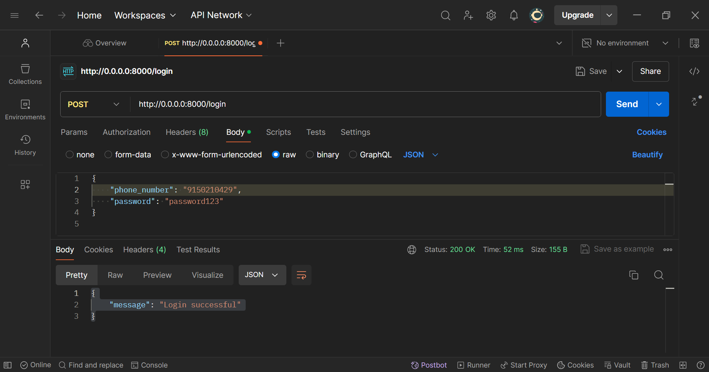
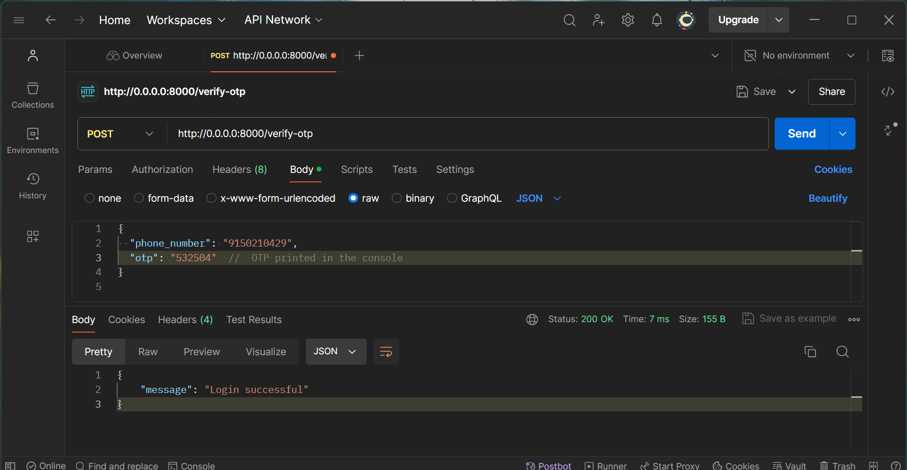

1. Created a FastAPI application with a login endpoint that checks the phone number and password.

2. Ran the FastAPI server locally.

3. Used Postman Desktop Agent to test the login endpoint with the following JSON payload:
{
    "phone_number": "9150210429",
}

4. Received a successful response, indicating the API is functioning as expected.

SCREENSHOT OF POSTMAN API :
1. Connection Established !

2. OTP Implemented implemented in terminal
